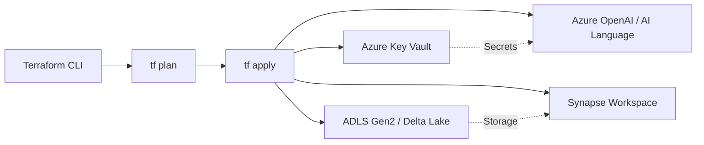
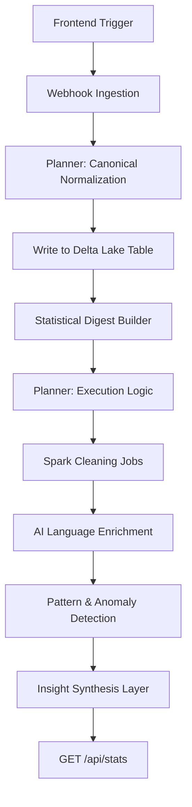

# 🌌 AETHER FLOW: Enterprise AI Data Pipeline

Aether Flow is a state-of-the-art, 11-step autonomous data pipeline designed to transform raw, unstructured datasets into executive-level intelligence. Powered by **Azure Synapse Analytics** and **GPT-4o**, it features a fully dynamic execution layer that adapts to any schema in real-time.

---

## 🚀 Key Features

- **Dynamic Execution Planning**: No hardcoded steps. The pipeline uses GPT-4o to analyze data digests and generate a custom execution plan (cleaning rules, enrichment targets).
- **Statistical Reliability**: Implements **IQR (Interquartile Range)** for robust anomaly detection and row-based quality indexing.
- **Conversational Intelligence**: A built-in **Data Intelligence Agent** with full context of the pipeline state, including enrichment justifications and statistical patterns.
- **Dynamic NLQ Suggestions**: Suggested queries in the UI are automatically generated based on discovered data issues (e.g., nulls in specific columns, high-variance fields).
- **Executive Observability**: A premium Next.js dashboard providing real-time audit trails and signal-vs-noise analysis.

---

## 🛠️ Architecture (11-Stage Flow)

1.  **Ingestion**: Event-driven ingestion (simulated via Webhook).
2.  **Canonical Normalization**: GPT-orchestrated schema mapping.
3.  **Normalization & Delta**: Conversion to canonical JSON / Delta Lake.
4.  **Statistical Digest**: Automated profiling (variance, null counts, skew).
5.  **LLM Execution Planning**: GPT-4o generates Phase 2 steps.
6.  **Spark Cleaning**: Programmatic application of AI-generated rules.
7.  **AI Language Enrichment**: Sentiment, NER, and Urgency scoring.
8.  **Pattern Discovery**: Isolation Forest and correlation analysis.
9.  **Insight Synthesis**: Executive takeaways and recommended actions.
10. **Data Intelligence Agent**: Conversational NLQ grounded in pipeline state.
11. **Interactive Visualization**: Live dashboard & Anomaly Explorer.

---

## 🏗️ Technical Workflows

### 1. Infrastructure (Terraform)
The infrastructure layer ensures a secure, scalable Azure environment.



- **Provisioning**: Creates a unified resource group for Data & AI services.
- **Security**: Sets up Managed Identities for Synapse to access ADLS and Key Vault without hardcoded credentials.
- **Scaling**: Configures Spark pools and SQL serverless endpoints for Step 11 queries.

---

### 2. Analytical Core (FastAPI Server)
The orchestration layer that manages the 11-step autonomous logic.



- **Stage 1 (Steps 1-4)**: Focuses on data landing and statistical profiling.
- **Stage 2 (Steps 5-10)**: High-altitude AI orchestration. GPT-4o analyzes the digest and "scripts" the Spark cleaning and Enrichment methods.
- **Stage 3 (Step 11)**: Persistent state is served to the NLQ chatbot for grounded Q&A.

---

### 3. Reactive UI (Next.js Frontend)
A high-performance dashboard built with a global reactive state.

```mermaid
graph TD
    Ctx[pipeline-context.tsx] --> Hooks[usePipeline Hook]
    Hooks --> Dash[RichDashboard]
    Hooks --> NLQ[NlqPanel / Chatbot]
    Hooks --> Anom[Anomaly Explorer]
    API[/api/stats] --> |Sync Every 2s| Ctx
    Ctx --> |State Update| Dash
```

- **State Management**: Uses a custom Provider (`pipeline-context`) to centralize metrics, audit trails, and suggested queries.
- **Micro-Animations**: Framer Motion is used for sequential card entry and progress bar surges.
- **Conversational UI**: The floating Data Intelligence Agent uses a dedicated Markdown parser for high-speed AI responses.

---

## 🛠️ Setup & Execution

### Backend
```bash
cd server
python -m venv venv
source venv/bin/activate
pip install -r requirements.txt
python main.py
```

### Frontend
```bash
cd Frontend
npm install
npm run dev
```

---

## 🔮 Future Roadmap: Multi-Modal Intelligent Extraction

We plan to expand Aether Flow into a "Multi-Modal Intelligence Engine" by integrating specialized Azure AI services for non-tabular data:

### 📄 PDF & Document Intelligence
- **Integration**: Azure AI Document Intelligence (Layout/Read API).
- **Capability**: Extract tables, key-value pairs, and structural text from complex PDF reports to be fed into Step 1 of the pipeline.

### 🖼️ Image Analysis
- **Integration**: Azure Computer Vision.
- **Capability**: Automated captioning, OCR, and object detection. Metadata extracted from images will be treated as "Enrichments" in Step 8.

### 🎥 Video Insights
- **Integration**: Azure Video Indexer.
- **Capability**: Facial recognition, sentiment analysis from audio, and keyframe extraction. Video "topics" will be merged into the executive insight layer.

### 🔍 Vector-Search RAG
- **Integration**: Azure AI Search (Vector Store).
- **Capability**: Indexing extracted multi-modal content for semantic "Insider" search via the Data Intelligence Agent.

---

## 📝 License
MIT License. Created for "Build With AI" Enterprise Hackathon.
